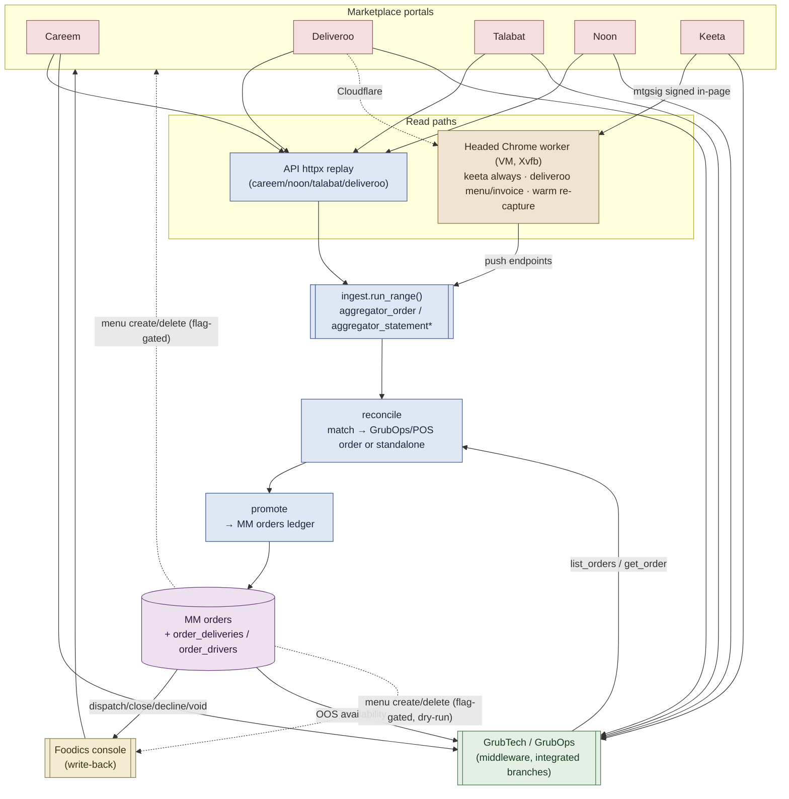
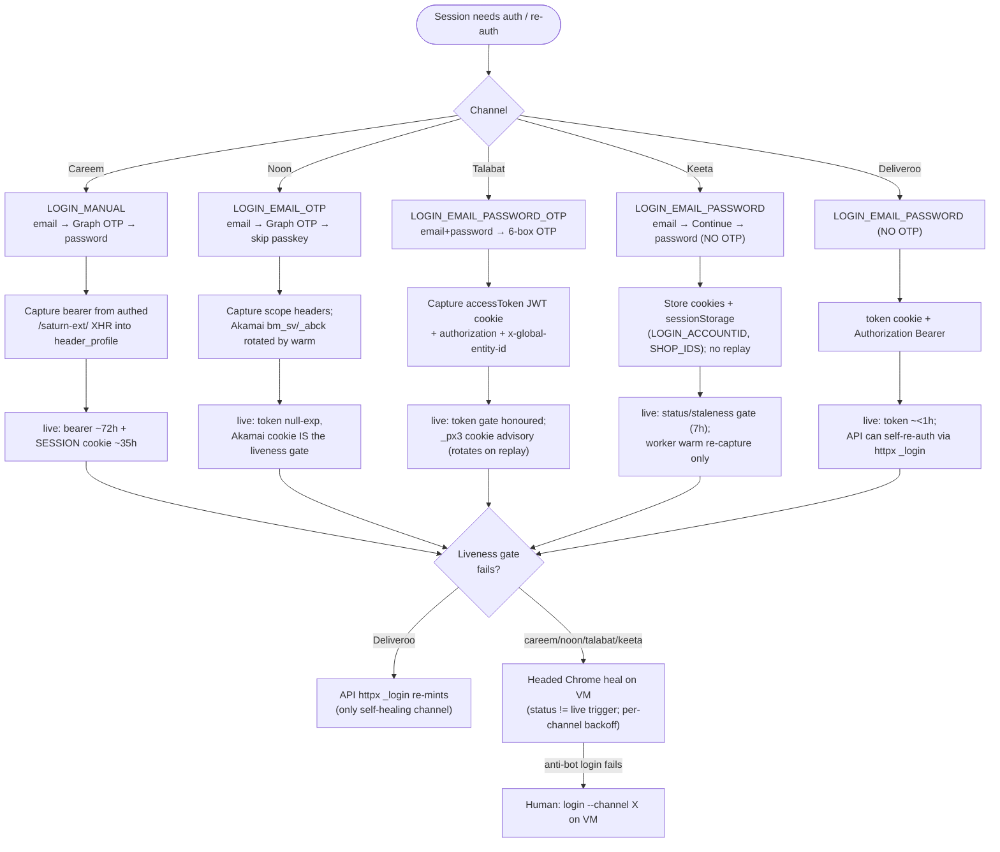

# Integrators & Aggregators — Canonical Reference

> **Canonical. Generated 2026-09-04 from code + live DB. Replaces the older
> aggregator capability docs** (`aggregator-catalog-hours-sync-audit.md`,
> `aggregator-depth-e2e-findings.md`, `aggregator-portal-operations-map.md`,
> `foodics-coverage-matrix.md`, `grubops-integration.md`,
> `integrator-capabilities.md`, `pos-foodics-parity.md`). The operational
> `aggregator-runbook.md` (how to heal on the VM) is kept separately.
>
> Line refs point at `apps/api/app/...` and the headed worker
> `apps/aggregator-bootstrap/src/aggregator_bootstrap/...`. Session-health and
> per-branch counts are point-in-time (see §6, §8).

---

## 1. Overview

Melting Moments sells through **five delivery marketplaces** plus its own POS,
and stitches every channel back into one MM order ledger.

| Party | Role | How we talk to it |
|-------|------|-------------------|
| **Careem** | Marketplace (aggregator) | httpx (TLS-impersonated) session replay |
| **Deliveroo** | Marketplace (aggregator) | httpx replay for sales/finance/hours; **headed Chrome** for menu/invoice (Cloudflare) |
| **Talabat** | Marketplace (aggregator) | httpx replay (DeliveryHero vendor-api) |
| **Noon** | Marketplace (aggregator) | httpx replay (dual-source OMS + RMS) |
| **Keeta** | Marketplace (aggregator) | **Headed Chrome only** — every XHR is `mtgsig`-signed in-page; nothing is server-replayable |
| **Foodics** | POS integrator | Server API — **write-back** channel for order dispatch/close and menu price parity |
| **GrubTech / GrubOps** | Order middleware | Server API — normalises the two integrated branches' marketplace orders and carries item availability (OOS) |

**Data path (one paragraph).** Marketplace portals are read either by the API
directly over `httpx` (careem/noon/talabat/deliveroo) or by a headed real Chrome
worker on the VM for the anti-bot channels (keeta always; deliveroo menu/invoice;
plus any warm re-capture). Hours for careem/noon/talabat/deliveroo are httpx.
Raw payloads land in `aggregator_order` / `aggregator_statement*`, then
**reconcile** matches each marketplace order to an existing GrubOps/POS order
(or files a standalone), and **promote** materialises it into the MM `orders`
ledger — mirroring riders onto `order_deliveries` and, for the two integrated
branches, adopting the GrubTech-normalised order. Writes
flow the other way: dispatch/close/decline/void is pushed through the **Foodics**
console, item availability through **GrubOps**, and (flag-gated, dry-run today)
menu create/delete through each marketplace plus a Foodics group/price-tag
cascade for parity.

---

## 2. Data flow



---

## 3. Per-channel auth / refresh flow



---

## 4. Capability matrix

**Legend** — `Y` wired & server-callable · `Y*` flag-gated / Phase-1 dry-run ·
`worker` headed VM browser only · `stub` httpx method exists but raises ·
`N` not built · `verify` built, endpoint not yet trusted.

Columns: R=Read, W=Write(create), U=Update, D=Delete.

| # | Functionality | Op | Careem | Noon | Talabat | Keeta | Deliveroo | Why-not / notes + code evidence |
|---|---------------|----|--------|------|---------|-------|-----------|----------------------------------|
| 1 | Sales / order ingest | R | Y | Y | Y | worker | Y | Keeta masks PII to `***` hours after the order → time-critical. `careem_provider.py:442`, `noon_provider.py:797`, `talabat_provider.py:820`, `deliveroo_provider.py:565`; keeta via `warm.pull_keeta_orders_in_page` (`warm.py:130`), httpx stub `keeta_provider.py:1484` |
| 2 | Order detail / line items | R | Y | Y | Y | worker | Y | Carried inside sales. Noon merges dual-source OMS (items) + RMS (fees) by `external_order_id` — `noon_provider.py:1-31,27` |
| 3 | Statements / fees / commission | R | Y | Y | Y | worker | Y | **Careem has NO per-order settlement** — commission rides the monthly Tax Invoice, not the order (`careem_provider.py:18-28,706`). `noon_provider.py:976`, `talabat_provider.py:1078`, `deliveroo_provider.py:820`; keeta `warm.pull_keeta_finance_in_page` (`warm.py:284`), stub `keeta_provider.py:1491` |
| 4 | Payouts | R | **N** | Y | Y | stub | Y | **Careem has no payout-request feed** — `payoutRequests/list` is coded (`careem_provider.py:767`) and called with the same billing accounts as the Tax Invoice list, but the portal returns 0 rows. Settlement is the monthly Tax Invoice only. `noon_provider.py:1078`, `talabat_provider.py:1203`, `deliveroo_provider.py:988`; keeta stub `keeta_provider.py:1496` |
| 5 | Settlement PDF / VAT doc | R | Y | Y | — | worker | Y | Deliveroo PDF (`deliveroo_provider.py` fetch_statements 820); noon CSV/bytes; keeta worker files. Orchestrated by `statement_docs.py` / `settlement_reconcile.py`. Careem VAT PDF = the monthly Tax Invoice archived by `fetch_statements` |
| 6 | Driver / fulfilment capture | R | Y | Y | Y | worker | **N** | **Deliveroo exposes no rider data.** Others land via `aggregator_fulfilment.record_aggregator_fulfilment` (`aggregator_fulfilment.py:43`) → mirrored onto `order_deliveries`/`order_drivers` by promote |
| 7 | Menu / catalog read | R | Y | Y | Y | worker | worker | httpx for careem/noon/talabat; keeta+deliveroo are anti-bot → worker. `_MENU_READERS` `menu_readers.py:885`; careem `list_catalog_products` `careem_provider.py:340`; talabat DeliveryHero vendor-api `talabat_provider.py:544,733`; noon `list_menus`/`get_menu_details` `noon_provider.py:402,410` |
| 8 | Opening-hours read | R | Y | Y | Y | worker | Y | Careem/noon/talabat/deliveroo are httpx. Keeta is **today-only** from the headed worker push — registered in `_HOURS_READERS` `menu_readers.py`. |
| 9 | Opening-hours write / holiday close | W/U/D | Y* | Y* | Y* | worker | Y* | httpx writers for careem/noon/talabat/deliveroo behind `CATALOG_SYNC_ENABLED`, **dry-run default**. Keeta omitted from `supported_channels()` (headed worker). `hours_writers.py` |
| 10 | Menu item create | W | Y | Y | Y* | worker | worker | careem `create_product`; noon `create_menu_item`; talabat Add Product drawer `POST .../vendors/{v}/catalogs/products` (Karama/DSO, needs `branch_id`; nested per-category products POST is 405). Master path = Foodics create → cascade once `foodics_branch_map` is seeded. `_CREATE_NEEDS_WORKER=(keeta,deliveroo)` |
| 11 | Menu item delete | D | Y | Y | verify | worker | worker | careem `delete_product` `careem_provider.py:409`; noon `delete_menu_item` `noon_provider.py:474`; keeta `warm.delete_keeta_item_in_page` `warm.py:262`. Same gating as create |
| 12 | Item availability toggle (OOS) | U | Y* | Y* | Y* | Y* | Y* | **All via GrubOps middleware** (one-way MM → GrubOps), portals have no trusted per-item availability API. `grubops_provider.mark_unavailable`/`mark_available` `grubops_provider.py:405,413`; gated `GRUBOPS_SYNC_ENABLED` |
| 13 | Menu price-parity reconcile | U | Y* | Y* | Y* | — | — | Foodics-driven for the integrated branches — `foodics_provider.set_price_tag_product_price` `foodics_provider.py:809`, `catalog_sync.py:718` (strict parity) |
| 14 | Branch / outlet discovery | R | Y | — | Y | — | Y | careem `discover_outlets` `careem_provider.py:264`; talabat/deliveroo derive from `aggregator_branch_map` in `prepare_session` (`talabat_provider.py:733`, `deliveroo_provider.py:371`) |
| 15 | Branch create / delete | C/D | **N** | **N** | **N** | **N** | **N** | Branch map is operator-seeded; nothing creates/deletes a marketplace outlet |
| 16 | Aggregator order → GrubOps ingest | R | Y* | Y* | Y* | Y* | Y* | `grubops_provider.list_orders` `grubops_provider.py:540`, `order_count` `:581`, `get_order` `:608`; gated `GRUBOPS_ORDERS_ENABLED` |
| 17 | Order write-back: dispatch/close/decline/void | U | Y* | Y* | Y* | Y* | Y* | **All via Foodics console** — `foodics_provider.update_delivery_status` `foodics_provider.py:609`, `accept_order` `:627`, `decline_order` `:634`, `close_order` `:640`, `void_order` `:649`; gated `FOODICS_ORDER_PUSH_ENABLED`; +5 min auto-close→delivered (`AGG_AUTO_CLOSE_SECONDS`) |
| 18 | Reconciliation / promotion to MM orders | W/U | Y* | Y* | Y* | Y* | Y* | `reconcile.py`, `promote.py`, `settlement_reconcile.py`; GrubOps adopt-grace `AGGREGATOR_GRUBOPS_ADOPT_GRACE_HOURS` |
| 19 | Coverage backfill after outage | R/W | Y | Y | Y | Y | Y | Sales-only, idempotent, hourly level-triggered re-pull of uncovered dates. `AGGREGATOR_COVERAGE_BACKFILL_DAYS=7` |

---

## 5. Feature-flag gating (every gate defaults **OFF**)

| Flag | Default | Gates | Where |
|------|---------|-------|-------|
| `AGGREGATOR_INGEST_ENABLED` | `False` | Master gate for the whole ingest loop | `config.py:413` |
| `CATALOG_SYNC_READ_ENABLED` | `False` | Read/diff side — fetch each integrator's menu & compute deltas | `config.py:531` |
| `CATALOG_SYNC_ENABLED` | `False` | **Master gate for every WRITE**; even enabled, Phase-1 is a **dry-run** that records the plan and mutates nothing | `config.py:539`; dry-run `catalog_sync.py:522,535,567` |
| `GRUBOPS_SYNC_ENABLED` | `False` | Item availability (OOS) push MM → GrubOps | `config.py:311` |
| `GRUBOPS_ORDERS_ENABLED` | `False` | Aggregator order → GrubOps ingest (read side) | `config.py:361` |
| `FOODICS_ORDER_PUSH_ENABLED` | `False` | Order write-back (dispatch/close/decline/void) via Foodics | `config.py:398` |

Related tunables (not on/off gates): `AGG_AUTO_CLOSE_SECONDS=300` (`config.py:376`),
`AGGREGATOR_GRUBOPS_ADOPT_GRACE_HOURS=12` (`config.py:458`),
`AGGREGATOR_SALES_REFRESH_MINUTES=60` (`config.py:488`),
`AGGREGATOR_COVERAGE_BACKFILL_DAYS=7` (`config.py:503`).

---

## 6. Per-branch support

Live 2026-09-04 — `aggregator_branch_map ⋈ branches ⋈ aggregator_order`, active
maps only, 30-day order counts.

**Physical branches:** Barsha Heights, Dubai Silicon Oasis (DSO), Sharjah
Kitchen, Al Karama. **Barsha + Sharjah** are Foodics/GrubTech-integrated (orders
flow through GrubTech middleware); **Karama + DSO** are aggregator-portal-only.

| Channel | Barsha | DSO | Sharjah | Karama | 30d total | Coverage gap |
|---------|-------:|----:|--------:|-------:|----------:|--------------|
| Careem | 15 | 4 | — | — | **19** | Barsha + DSO only (no Sharjah, no Karama) |
| Deliveroo | 17 | 12 | 7 | — | **36** | No Karama |
| Keeta | 124 | 113 | 350 | 96 | **683** | All 4 branches |
| Noon | 19 | 29 | 85 | 11 | **144** | All 4 branches |
| Talabat | 48 | — | 218 | 18 | **284** | No DSO |

Coverage in one line: **Keeta & Noon = all 4** · **Careem = Barsha + DSO only** ·
**Talabat = no DSO** · **Deliveroo = no Karama**.

---

## 7. Per-channel auth & session-refresh

| | Careem | Noon | Talabat | Keeta | Deliveroo |
|---|--------|------|---------|-------|-----------|
| **Login method** | `LOGIN_MANUAL` | `LOGIN_EMAIL_OTP` | `LOGIN_EMAIL_PASSWORD_OTP` | `LOGIN_EMAIL_PASSWORD` | `LOGIN_EMAIL_PASSWORD` |
| **Flow** | email → OTP → password (`login.py:813`) | email → OTP → skip passkey (`login.py:437`) | email+password → 6-box OTP (`login.py:221`) | email → Continue → password, **no OTP** (`login.py:677`) | email → password, **no OTP** (`login.py:101`) |
| **OTP source** | Graph — `go@careem.com` / "Careem One Time Password" | Graph — `verify@noon` / "Verify" | `no-reply@partner-app.talabat.com` / "Partner Portal" | — (none) | — (none) |
| **Session shape** | bearer in `header_profile` (`probes.py:57-62`) | scope headers + Akamai cookies (`probes.py:77-95`) | `accessToken` JWT cookie + authorization + `x-global-entity-id` (`probes.py:70-76`) | cookies + sessionStorage only (`LOGIN_ACCOUNTID`, `SHOP_IDS`), **no replay** (`probes.py:96-101`; `login.py:553-564,649-666`) | token cookie + Authorization Bearer (`probes.py:64-69`) |
| **Token / cookie TTL** | bearer ~72h, SESSION cookie ~35h, `_gat` 1-min excluded | token **null-exp** | `accessToken` honoured; `_px3` ~5 min nominal but **rotates on replay** → advisory | cookie TTL **>1 yr** (exp 2027) | identity token **lasts <1h** (`deliveroo_provider.py:90`) |
| **Liveness gate** | token + cookie both honoured | **Akamai `bm_sv`/`_abck` cookie** is the gate | **token only** (cookie advisory) — `session_store.py:249,284` | status / staleness (7h) | token + cookie honoured |
| **Who re-auths** | worker only | worker only | worker only | worker only (warm re-capture) | **API itself via httpx `_login`** — the only self-healing channel (`deliveroo_provider.py:371,442`) |
| **Anti-bot wall** | reCAPTCHA-v3 (headed Chrome waits for a real token, 1 score retry, persistent `careem.chrome`; visible v2 is solved in-process: checkbox click + audio transcription or 2captcha, ≤90s — not a 45min wait) | Akamai | PerimeterX "press and hold" | captcha / device wall + HK↔AE region trap; `mtgsig` in-page signing (`keeta_provider.py:4-19`) | Cloudflare interstitial on server calls → headed Xvfb for menu/invoice |
| **Refresh trick** | capture bearer off first authed `/saturn-ext/` XHR (`probes.py:57`) | warm loads console root to rotate Akamai cookie (`probes.py:77-88`) | `_px3` expiry treated advisory (`policy.ChannelPolicy.cookie_expiry_advisory`, `policy.py:40,54`; applied `session_store.py:273`) | worker warm re-recaptures cookies+sessionStorage in-page | httpx `_login` re-mints the short token in-band |

---

## 8. Live session health snapshot (2026-09-04)

> Point-in-time from `aggregator_session`. Health changes hour-to-hour; treat as
> a snapshot, not a steady state.

| Channel | Status | Note |
|---------|--------|------|
| **Careem** | `needs_bootstrap` | token expired 09-02; in human-needed backoff until 09-04 12:15 — needs a headed re-login |
| **Deliveroo** | `live` | self-heals via httpx `_login` |
| **Keeta** | `live` | never runs the httpx sweep (push-only); cookie exp 2027 |
| **Noon** | `live` | null token-exp; Akamai-cookie-gated |
| **Talabat** | `live` | token exp is in the past but **advisory** (cookie rotates) |

---

## 9. Why-not root causes

- **Keeta — no server-replayable session.** Every XHR is `mtgsig`-signed *in the
  page* (Meituan infra); the httpx provider raises on every method
  (`keeta_provider.py:4-19,1484-1499`). All keeta read/write is the headed worker.
- **Deliveroo menu — Cloudflare + webrom `logon-pass`.** Sales/finance/hours GET
  go over httpx; the menu still needs headed Chrome.
- **Talabat create is flag-gated httpx.** Nested per-item POST
  (`.../catalogs/{id}/categories/{id}/products`) is 405. The partner Add Product
  drawer POSTs `.../vendors/{vendor}/catalogs/products` with
  `{name, description, unitPrice, catalogIds, category, type:"Simple", active}`
  and returns `{commandId}` (async). Wired in `talabat_provider.create_menu_item`
  / `catalog_sync._create_on_talabat`, behind `CATALOG_SYNC_ENABLED`, dry-run
  default. Keeta/deliveroo create still needs the headed worker
  (`_CREATE_NEEDS_WORKER`).
- **Keeta hours write is worker-only.** httpx writers exist for
  careem/noon/talabat/deliveroo (`hours_writers.supported_channels()`), dry-run
  default, gated `CATALOG_SYNC_ENABLED`. The 05:00 `KEETA_HOURS` job POSTs
  `POST /api/scm/business-hour/update` (`{shopId, businessHourOfTheWeek}`) after
  GET `/api/scm/business-hour/effective-data/get`, in-page on the persistent
  profile. Operator confirmation (one Chrome; stop the daemon if it holds
  `keeta.chrome`):
  ```bash
  docker compose -f docker-compose.prod.yml run --rm aggregator-worker \
    probe-keeta-hours-save --wait-seconds 90
  ```
  Listen-only — does not POST.
- **OOS goes via GrubOps.** Portals expose no trusted per-item availability API,
  and GrubTech has no partner API (console login) — so availability is one-way
  MM → GrubOps middleware.
- **Deliveroo has no rider data** → no driver/fulfilment capture (row 6).
- **Careem has no per-order settlement and no payout-request feed** → commission
  and settlement live only on the monthly Tax Invoice (rows 3–4). Customer name
  / phone are withheld (only a `user_id`); Talabat likewise withholds customer
  PII; Deliveroo exposes no rider API. Do not invent scrapers for those.

---

## 10. CRUD × channel grid

Consolidated view of what each channel can do, by operation. `Y`=server-callable,
`Y*`=flag-gated/dry-run, `W`=worker-only, `st`=stub(raises), `v`=verify, `N`=no.

| Operation | Careem | Noon | Talabat | Keeta | Deliveroo |
|-----------|:------:|:----:|:-------:|:-----:|:---------:|
| **R** Sales / detail / fees | Y | Y | Y | W | Y |
| **R** Payouts | **N** | Y | Y | st | Y |
| **R** Settlement doc | Y | Y | N | W | Y |
| **R** Driver / fulfilment | Y | Y | Y | W | **N** |
| **R** Menu read | Y | Y | Y | W | W |
| **R** Hours read | Y | Y | Y | W | Y |
| **R** Outlet discovery | Y | N | Y | N | Y |
| **R** GrubOps order ingest | Y* | Y* | Y* | Y* | Y* |
| **W** Menu item create | Y | Y | Y* | W | W |
| **W** Branch create | N | N | N | N | N |
| **U** OOS availability (GrubOps) | Y* | Y* | Y* | Y* | Y* |
| **U** Price parity (Foodics) | Y* | Y* | Y* | N | N |
| **U** Hours write | Y* | Y* | Y* | W | Y* |
| **U** Order write-back (Foodics) | Y* | Y* | Y* | Y* | Y* |
| **U/W** Reconcile / promote | Y* | Y* | Y* | Y* | Y* |
| **W** Coverage backfill | Y | Y | Y | Y | Y |
| **D** Menu item delete | Y | Y | v | W | W |
| **D** Branch delete | N | N | N | N | N |

---

## Appendix — Operations

**Manual re-run for a date** (idempotent; keeta re-ingests from stored raw). The
live API slot alternates `api` / `api-green` per deploy — derive it from
`docker ps`:

```bash
docker compose exec <live-api-slot> python -c "import asyncio,datetime; \
from app.services.aggregators import ingest; \
asyncio.run(ingest.run_range(['noon','talabat','careem','deliveroo','keeta'], \
datetime.date(Y,M,D), datetime.date(Y,M,D)))"
```

**A stuck channel needs a human.** Anti-bot channels (careem/noon/talabat/keeta)
cannot self-re-login — when a session is `needs_bootstrap`/dead, a person runs a
headed login on the VM:

```bash
gcloud compute ssh mm-backend --zone=me-central1-a
# then, on the VM, in the aggregator worker:
login --channel <careem|noon|talabat|keeta>
```

Deliveroo is the exception — it re-auths itself over httpx (`_login`) and needs
no human unless the password itself changed.
